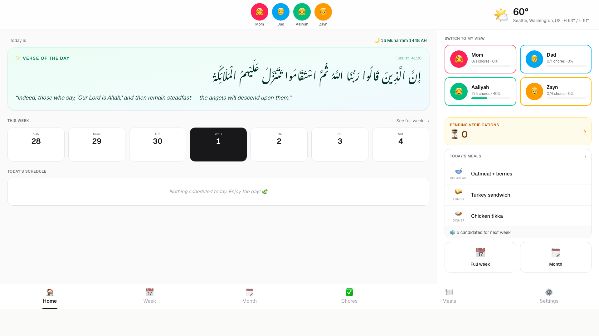

# zFamily

A wall-mounted family hub — calendar, chores, meals, shopping — designed to run on a 15.6" touch HDMI display attached to a Linux box, plus a mobile companion PWA that lives on family members' phones.

Inspired by Skylight Calendar, Cozyla, DAKboard, and Hearth.



## Table of contents

- [What's in the box](#whats-in-the-box)
- [Screens](#screens)
- [Requirements](#requirements)
- [Quick start (dev)](#quick-start-dev)
- [Production install (Linux kiosk)](#production-install-linux-kiosk)
- [Google Calendar setup](#google-calendar-setup)
- [Configuration reference](#configuration-reference)
- [Authentication (PINs)](#authentication-pins)
- [Data & backup](#data--backup)
- [Mobile companion (PWA)](#mobile-companion-pwa)
- [Remote access (Tailscale)](#remote-access-tailscale)
- [Screensaver & quiet hours](#screensaver--quiet-hours)
- [Testing](#testing)
- [Project layout](#project-layout)
- [Development tips](#development-tips)
- [Troubleshooting](#troubleshooting)
- [Roadmap](#roadmap)

## What's in the box

- **Family home dashboard** with Quranic verse of the day (Arabic + English translation, deterministic per date), Hijri (Umm al-Qura) date with moon-sighting correction, weekly overview, today's breakfast/lunch/dinner panel, and quick tiles.
- **Weekly + monthly calendar** with per-member color coding, all-day strip, hourly grid, red "now" line. Events support **multiple participants** (with All / Clear quick-select) and render as a **gradient of their colors** in one consolidated block. Editing/deleting an event is parent-PIN gated.
- **Event location + commute** — give an event a location (type a name and **look up** the full address via OpenStreetMap); the app then estimates the **commute time from home** (🚗 car via OSRM, or 🚌 bus as a distance-based estimate) and shows it in the event details and Today's schedule. Set your **home address** in Settings → Display (it's also used as the weather location).
- **Recurring events** — locally-created events support daily, weekdays, weekly, monthly, or quarterly recurrence (client-expanded from RRULE).
- **Chore board** with pending → verified two-step (parents verify children; parents peer-verify each other), big touch check-off circles, daily/weekly/weekend recurrence, points, streaks (🔥), weekly progress bars. A **chore library** of common household chores (empty the dishwasher, take garbage to curb every Sunday, clean the kitchen…) pre-fills the editor so you just assign who does it. **Common chores** can be marked doable-by-anyone — the first person to do it completes it for everyone that period, and you pick who did it.
- **Gamification** — every verified chore earns points; parent-approved rewards shelf lets kids spend points on real rewards.
- **Meal planner** — weekly breakfast/lunch/dinner grid, meal library with ingredients (quantity + unit), favorites (❤️). Each meal is marked eligible for breakfast/lunch/dinner so the slot picker only offers meals that fit, and you can filter the list by an ingredient you already have.
- **Meal ideas (proposals)** — a future wishlist of dishes, not tied to a date. **Lunch & dinner are shared** and the family votes (medals for the favorites); **breakfast is each person's own pick**. Nothing auto-fills — proposed dishes show up in the day's slot picker for a parent to place.
- **Shopping list** — when a meal is placed on the plan you choose which of its ingredients get added (starts unselected), shared with the mobile companion.
- **Emoji/icon picker** — a curated tap-to-choose icon grid everywhere an icon is set (members, chores, rewards, meals), with a "type your own" box for any emoji. A member's chosen icon (or a neutral person glyph) is their avatar until a headshot is uploaded.
- **On-screen keyboard** (optional, Settings → Display) — a touch QWERTY that surfaces on a ⌨️ button when a text field is focused, for kiosks with no physical keyboard.
- **Kiosk menu** — right-click / long-press anywhere on the wall display opens an app menu (refresh, connection check, sync, fullscreen, settings) instead of the browser's native context menu, which is suppressed. The mobile PWA keeps normal browser behavior.
- **In-app software update** (Settings → Advanced) — a parent can pull the latest code, rebuild on the device, and restart, all from the wall display. All in-app confirmations use styled dialogs (no native `alert`/`confirm`).
- **Quran verse context** — tap the verse-of-the-day reference to open the ayah in an in-app tanzil.net reader (Ali Quli Qarai translation); long verses are clamped with a "read the full ayah" link. Stays inside the app — no external browser window on the locked kiosk.
- **PIN authentication** — 4-digit PIN per member with on-screen numeric keypad. Opening **Settings** unlocks once with a parent PIN, then saves don't re-prompt until you leave; chore verification still asks each time; adding a meal needs no PIN. Parents can reset a child's PIN without knowing the current one. First-launch gate forces parents to set a PIN.
- **Personal views** at `/me/[memberId]` — each member has their own screen with their chores, schedule, meal vote panel, and rewards. Reverts to family home after configurable idle (default 2 min).
- **Weather** via Open-Meteo (no API key), with **city/state search** that auto-fills coordinates and IANA timezone in one tap. Header widget + screensaver display.
- **Google Calendar sync** per family member with incremental sync tokens.
- **iCal calendar subscriptions** — subscribe to any read-only iCal/`webcal` URL (e.g. a Google "secret address in iCal format"); recurrences are expanded and refreshed on a per-feed interval.
- **Screensaver** with quiet-hour schedule, clock + next event + weather, tap-to-wake. Interacting during quiet hours suspends the blackout for 5 minutes from your last touch.
- **Mobile companion PWA** at `/m` — quick chore check-off, event add, meal voting, and shopping list from any phone.
- **Playwright end-to-end tests** covering critical flows (PIN gates, weather save + header refresh, chore verify, home meal panel).

## Screens

| Route | Description |
|-------|-------------|
| `/` | Family dashboard: verse of the day, Hijri date, week overview, member tiles (default) |
| `/week` | Full week view + today sidebar (calendar + chores) |
| `/month` | Full month grid |
| `/chores` | Per-member chore board with pending verifications and rewards shelf |
| `/meals` | Weekly meal plan + shopping list panel + meal library + vote-for-next-week |
| `/settings` | Family (names, nicknames, headshots, roles + PINs), chores, rewards, calendars (Google account links + iCal subscriptions), weather, display (quiet hours, Hijri offset, idle), advanced (factory reset) |
| `/me/[memberId]` | Personal view — that member's chores, schedule, meal votes, rewards |
| `/m` | Mobile home (chore progress + today's events + shopping + vote tile) |
| `/m/chores/[memberId]` | Per-member mobile chore check-off (with verify pills) |
| `/m/event` | Mobile quick-add event (with recurrence) |
| `/m/shopping` | Mobile shopping list |
| `/m/vote` | Mobile meal voting |

## Requirements

**Display device**
- Any Linux distribution with X11 or Wayland and Chromium/Chrome
- Recommended: Raspberry Pi 4/5, Intel NUC, or any small-form-factor PC
- 15.6" 1920×1080 touch monitor (built for Innoview; any HDMI touch panel works)

**Software**
- Node.js 20+ (18 works, 25 tested)
- npm (or pnpm/yarn — package.json is npm-lockfile)

**Optional**
- Google Cloud project with OAuth 2.0 Client ID for Calendar sync

## Quick start (dev)

```bash
git clone <your fork url> zfamily
cd zfamily
npm install
npm run dev
# → http://localhost:3000
```

On first boot the app has no family yet — it opens a **family setup workflow** on the wall display that walks you through adding each member (parents and children) and picking your location for weather. After that, each parent is prompted to choose a PIN. A starter meal library and reward menu are seeded so you have something to work with; change everything in Settings.

To start over, use **Settings → ⚠️ Advanced → Factory reset**, which erases all data and returns to the first-run setup workflow.

## Production install (Linux kiosk)

### 1. Get the code onto the device

```bash
sudo mkdir -p /opt/zfamily
sudo chown $USER /opt/zfamily
cd /opt/zfamily
git clone <your fork url> .
npm install
npm run build
```

### 2. Create the runtime user + data dir

```bash
sudo useradd -r -s /bin/false zfamily
sudo mkdir -p /var/lib/zfamily/backups          # data dir + default on-device backups folder
sudo chown -R zfamily:zfamily /var/lib/zfamily  # the service writes backups here
```

The `backups/` subfolder is where **Save backup now** and the periodic **auto-backup** write files (see [Data & backup](#data--backup)). It must be writable by the `zfamily` user. To store backups elsewhere (e.g. a mounted USB drive or NAS share), create that directory, `chown` it to `zfamily`, and set the path in **Settings → Advanced → Backup & restore**.

### 3. systemd unit for the server

`/etc/systemd/system/zfamily.service`:

```ini
[Unit]
Description=zFamily family hub
After=network-online.target
Wants=network-online.target

[Service]
Type=simple
User=zfamily
WorkingDirectory=/opt/zfamily
Environment=NODE_ENV=production
Environment=ZFAMILY_DATA_DIR=/var/lib/zfamily
Environment=ZFAMILY_BASE_URL=http://localhost:3000
# Optional — only needed for Google Calendar sync:
# Environment=GOOGLE_CLIENT_ID=your-client-id.apps.googleusercontent.com
# Environment=GOOGLE_CLIENT_SECRET=your-secret
EnvironmentFile=-/etc/zfamily.env
# systemd runs with a minimal PATH and needs an absolute executable — the
# #!/usr/bin/env node shebang in npm/next also needs node on PATH. Point at
# node directly and add its directory to PATH. Find your node path with:
#   readlink -f "$(which node)"      # e.g. /usr/bin/node or /usr/local/bin/node
Environment=PATH=/usr/local/bin:/usr/bin:/bin
ExecStart=/usr/bin/node /opt/zfamily/node_modules/next/dist/bin/next start
Restart=on-failure
RestartSec=5s

[Install]
WantedBy=multi-user.target
```

Optionally put secrets in `/etc/zfamily.env` (0600 root:zfamily) instead of inline.

```bash
sudo systemctl daemon-reload
sudo systemctl enable --now zfamily
sudo systemctl status zfamily
```

### 4. Auto-launch Chromium in kiosk mode

`~/.config/autostart/zfamily-kiosk.desktop`:

```ini
[Desktop Entry]
Type=Application
Name=zFamily Kiosk
Exec=/usr/bin/chromium-browser --kiosk --noerrdialogs --disable-translate --no-first-run --disable-features=TranslateUI --check-for-update-interval=31536000 --disable-pinch --overscroll-history-navigation=0 --app=http://localhost:3000
X-GNOME-Autostart-enabled=true
```

Notes:
- `--app=` opens without any browser chrome.
- `--disable-pinch` prevents accidental zoom on touch.
- `--overscroll-history-navigation=0` disables swipe-to-go-back.

### 5. Disable screen blanking

```bash
xset s off
xset -dpms
xset s noblank
```

For Raspberry Pi OS also add `consoleblank=0` to `/boot/cmdline.txt`.

### 6. Periodic Google Calendar sync

Add a systemd timer or cron entry:

```cron
*/15 * * * * curl -s -X POST http://localhost:3000/api/sync >/dev/null
```

`/api/sync` also refreshes any due iCal subscription feeds (see below). On the
always-on kiosk this happens automatically anyway — a background poller pings
`/api/ical/sync` on each feed's interval — so cron is only needed for headless
installs or to also pull OAuth-linked Google accounts.

### 7. Updating to a new version

Your data lives in `ZFAMILY_DATA_DIR` (`/var/lib/zfamily`), **not** in the app directory, so updates never touch the database — schema migrations run automatically on the next boot.

**One command** (bundled script — pulls, installs, builds, restarts):

```bash
cd /opt/zfamily
npm run update              # or: ./scripts/update.sh
```

Useful flags: `BRANCH=main npm run update` to switch branch, `NO_RESTART=1` to build without restarting, `RELOAD_KIOSK=1` to also hard-reload the Chromium tab, `SERVICE=<name>` if your unit isn't `zfamily`.

#### From inside the app (Settings → Advanced → Software update)

A parent can **Check for updates** and **Update now** from the wall display — it runs the same `git pull → npm install → npm run build` on the device, shows the log, then prompts for the **system password** to restart the service (`sudo -S systemctl restart …`; the password is piped to sudo and never stored). For this to work on a systemd install:

```bash
# 1. The service user must OWN the checkout so it can pull & rebuild:
sudo chown -R zfamily:zfamily /opt/zfamily

# 2. Give it a password and a scoped sudo rule for just the restart command,
#    so the password you type in the app authorizes only that:
sudo passwd zfamily
echo 'zfamily ALL=(ALL) PASSWD: /usr/bin/systemctl restart zfamily' | sudo tee /etc/sudoers.d/zfamily-restart
sudo chmod 440 /etc/sudoers.d/zfamily-restart
```

The password you enter in the app is the **`zfamily` service account's** password (set in step 2), not your login password. Set the service name in the same panel if your unit isn't `zfamily`. Prefer the CLI `npm run update` for big jumps; the in-app updater is best for quick same-branch updates.

<details><summary>Equivalent manual steps</summary>

```bash
cd /opt/zfamily
git pull                           # or: git fetch && git checkout <tag/branch>
npm install                        # picks up any new/updated dependencies
npm run build                      # Turbopack production build + full type-check
sudo systemctl restart zfamily     # restart the server
sudo systemctl status zfamily      # confirm it came back healthy
```
</details>

Then reload the kiosk display so the browser picks up the new assets (favicon, icons, JS):

```bash
# from the kiosk desktop session — reload the Chromium kiosk tab
DISPLAY=:0 xdotool key ctrl+shift+r     # hard reload (clears cached favicon/JS)
# …or simply reboot the device:  sudo reboot
```

Notes:
- **Back up first** if it's a big jump — copy `ZFAMILY_DATA_DIR` (see [Data & backup](#data--backup)). Migrations are additive (`CREATE IF NOT EXISTS` + `ensureColumn`), so downgrades aren't guaranteed to work; a copy lets you roll back.
- If `npm run build` fails, the old build is still on disk and the service keeps serving it until you `restart`, so a failed update won't take the wall display down.
- If a build pulls in a new Node major, update the `PATH`/`ExecStart` node path in the systemd unit to match (`readlink -f "$(which node)"`).

## Calendar subscriptions (iCal feeds)

Beyond per-member OAuth sync, you can subscribe to any read-only calendar by its
**iCal URL** — including a Google Calendar's *Settings → Integrate calendar →
Secret address in iCal format*, or Apple/Outlook `webcal://` links.

Add one under **Settings → 📆 Calendars**: give it a name, paste the secret
address, optionally attach it to a member (for color), and set a sync interval
in hours. Feed events are fetched, recurrences (RRULE/EXDATE) expanded, and
written into the events table, so they appear across the week/month views and
home screen like any other event. Feeds refresh on their interval (kiosk poller
or `POST /api/sync`), and **Sync all** forces an immediate refresh.

Keep secret addresses private — anyone with the link can read that calendar.

Manual refresh from the CLI:

```bash
curl -X POST 'http://localhost:3000/api/ical/sync?force=1'
```

## Google Calendar setup

1. Google Cloud Console → **APIs & Services** → **Credentials**.
2. Create OAuth 2.0 Client ID, type **Web application**.
3. Authorized redirect URI: `http://<your-device-host>:3000/api/auth/google/callback`
   - For local dev: `http://localhost:3000/api/auth/google/callback`
4. Enable the **Google Calendar API** for the project.
5. Set env vars:

   ```bash
   export GOOGLE_CLIENT_ID=...
   export GOOGLE_CLIENT_SECRET=...
   export ZFAMILY_BASE_URL=http://localhost:3000
   ```

6. In **Settings → 📆 Calendars → Google accounts**, tap "Link Google" next to each family member.
7. Each person authorizes their own Google account; their primary calendar starts syncing to zFamily.

Sync is incremental — after the first pull, only changed events transfer.

### App verification note

Personal-scope OAuth apps in Google Cloud stay in "testing" mode indefinitely unless you go through the verification flow. In testing mode the OAuth screen shows an "unverified app" warning; you can still proceed. Only the test users you add can log in until you verify.

## Configuration reference

### Environment variables

| Variable | Default | Purpose |
|----------|---------|---------|
| `ZFAMILY_DATA_DIR` | `<repo>/.data` | Where `zfamily.db` lives |
| `ZFAMILY_BASE_URL` | `http://localhost:3000` | Public base URL — used to build the OAuth redirect |
| `GOOGLE_CLIENT_ID` | — | Google OAuth client ID (required for Calendar sync) |
| `GOOGLE_CLIENT_SECRET` | — | Google OAuth client secret |
| `PORT` | `3000` | Port for `next start` |

### In-app settings (Settings tab)

| Setting | Where | Default | Notes |
|---------|-------|---------|-------|
| City search | Weather | — | Type a city/state → one-tap fill of label, lat, lon, and timezone (Open-Meteo geocoder, no key) |
| Weather label | Weather | San Francisco | Free text shown in the header |
| Latitude / longitude | Weather | 37.77 / -122.42 | Auto-filled by city search; editable |
| Timezone (IANA) | Weather | `America/Los_Angeles` | Auto-filled by city search; used for the weather fetch |
| Quiet hours | Display | 21:00 – 07:00 | Auto-activates screensaver during window |
| Idle timeout | Display | 5 min | Screensaver kicks in after this long idle |
| Screensaver mode | Display | Clock + next | Clock only, or clock + next event + weather |
| Personal-view auto-revert | Display | 2 min | Personal `/me/[id]` view reverts to family home after this idle |
| Chore reset hour | Display | 4 (04:00) | Daily chores reset at this hour local |
| Hijri offset (moon-sighting) | Display | 0 | Shift Islamic (Umm al-Qura) date by ±3 days |
| On-screen keyboard | Display | Off | Show a touch QWERTY (via a ⌨️ button) when a text field is focused — for kiosks with no physical keyboard |
| Home address | Display | none | Origin for event commute estimates; also sets the weather location (geocoded via OpenStreetMap Nominatim) |
| Commute by | Display | Car | Car (OSRM driving) or Bus (rough distance-based estimate) for event commute times |
| Member PIN | Family | not set | 4-digit numeric — required for personal + admin actions |
| Member role | Family | parent | Parent or child; determines verify rules and access to admin |
| Member nickname | Family | none | Optional friendly name shown around the app in place of the given name |
| Member headshot | Family | none | Optional photo (cropped/resized on-device, stored in SQLite); falls back to emoji, then initial |

## Authentication (PINs)

Every family member can have a 4-digit numeric PIN. Actions are gated by PIN using an on-screen keypad; a successful PIN is cached in-memory for 60 seconds so rapid actions don't re-prompt.

**Personal actions** — need the acting member's PIN:
- Verifying a chore completion (verifier PIN)
- Casting/withdrawing a meal vote (voter PIN)
- Redeeming a reward (approving parent PIN)

**Admin actions** — need any parent's PIN:
- Adding/editing/deleting family members, chores, meals, rewards
- Changing weather, display, quiet hours, Hijri offset, or any other setting

**First-launch gate**: if any parent doesn't have a PIN, a full-screen setup blocker requires each parent to set one before the app can be used. This makes admin protection work-out-of-the-box.

PINs are stored as scrypt hashes with per-member salts. Timing-safe compare on verify. PINs are never sent to disk in plaintext.

## Data & backup

Everything lives in **one SQLite file**: `${ZFAMILY_DATA_DIR}/zfamily.db`.

Tables:

- `members` — family members + role + PIN hash/salt + Google credentials
- `events` — cached calendar events (Google or local, with optional RRULE, location/address + cached commute)
- `event_members` — participants join (an event can have several members)
- `chores`, `chore_assignees` — chore definitions
- `chore_completions` — daily check-off log with verified_at/verified_by
- `meals` — meal library with JSON ingredients + is_favorite flag
- `meal_plan_entries` — which meal is planned for a date+slot
- `meal_proposals`, `meal_votes` — weekly meal voting
- `shopping_items` — shopping list
- `rewards`, `reward_redemptions` — gamification (points shelf + audit log)
- `settings` — key/value config

### In-app backup / restore (easiest)

**Settings → ⚠️ Advanced → 💾 Backup & restore** lets a parent, right from the wall display:

- **Export backup** — downloads a single `zfamily-backup-YYYY-MM-DD.json` file with **all** data (members + headshot photos, chores and completions, events, meal plans/shopping, rewards, PINs, and settings; photos are base64-embedded).
- **Restore from backup** — upload a backup file to **replace everything** currently on the device (runs in one transaction, so a bad file leaves your data untouched). The app reloads when done. This is also offered on the first-run / after-erase **Welcome** screen.
- **Save on device** — write timestamped backups to a folder on the device instead of downloading. Defaults to `${ZFAMILY_DATA_DIR}/backups` (e.g. `/var/lib/zfamily/backups`); set a custom path (USB/NAS) in the same panel. Stored backups are listed with a one-tap **Restore**.
- **Automatic backup** — on by default, **weekly** (also daily/monthly). Runs off the always-on kiosk's periodic sync, keeps the most recent 12 auto-backups, and skips when there's no family yet. Toggle/interval live in the same panel.

Backup files contain PIN hashes and linked-account tokens — treat them like passwords, and pick a backup folder with matching access controls.

### Backing up (file-level)

```bash
sudo systemctl stop zfamily
sudo cp /var/lib/zfamily/zfamily.db /var/lib/zfamily/zfamily.db.bak-$(date +%F)
sudo systemctl start zfamily
```

Or online (WAL mode is on, so this is safe):

```bash
sqlite3 /var/lib/zfamily/zfamily.db ".backup '/var/lib/zfamily/zfamily.db.bak'"
```

### Restore

```bash
sudo systemctl stop zfamily
sudo cp your-backup.db /var/lib/zfamily/zfamily.db
sudo systemctl start zfamily
```

### Migrations

The schema is applied via `CREATE TABLE IF NOT EXISTS` on every boot in `src/lib/db.ts`. New columns require additive ALTER statements (add them to the migration function). There is no down-migration path.

## Mobile companion (PWA)

Family members can install zFamily on their phone home screen. The PWA scope is `/m`, so installing from `http://<your-host>:3000/m` gets a phone-optimized shell.

Features:
- Chore progress dashboard per member
- One-tap check-off (long-press to undo)
- Quick-add event that pushes to the shared calendar
- Shared shopping list

**Install on iOS**: Safari → open `/m` → Share → Add to Home Screen.
**Install on Android**: Chrome → open `/m` → menu → Install app.

To reach the dashboard and PWA from phones and laptops that aren't on your home Wi‑Fi, see [Remote access (Tailscale)](#remote-access-tailscale) below.

## Remote access (Tailscale)

[Tailscale](https://tailscale.com) is the simplest way to reach the wall display's dashboard from other devices — your phone, a laptop, another room — without port‑forwarding, a public IP, or exposing zFamily to the internet. It builds a private WireGuard mesh (your "tailnet"); only devices you've signed in can connect. This is the recommended approach over a public reverse proxy for a single‑family home hub.

zFamily's server already listens on all interfaces (`0.0.0.0:3000`), so once the host is on your tailnet it's reachable over the Tailscale link with no app changes.

### 1. Install Tailscale on the kiosk host

```bash
curl -fsSL https://tailscale.com/install.sh | sh
sudo tailscale up
```

Follow the printed URL to authenticate the device into your tailnet. Give it a recognizable name (e.g. `zfamily-kiosk`) in the [Tailscale admin console](https://login.tailscale.com/admin/machines) — with [MagicDNS](https://tailscale.com/kb/1081/magicdns) enabled (on by default) that name becomes its hostname.

### 2. Install Tailscale on the devices that need access

Install the Tailscale app on each phone/laptop ([iOS](https://apps.apple.com/app/tailscale/id1470499037), Android, macOS, Windows, Linux) and sign in with the **same account**. They all join the one tailnet and can see each other.

### 3. Open the dashboard from anywhere on the tailnet

Using the kiosk's MagicDNS name (or its `100.x.y.z` Tailscale IP from the admin console):

- Wall dashboard: `http://zfamily-kiosk:3000`
- Mobile PWA: `http://zfamily-kiosk:3000/m`

This works from cellular data too — Tailscale routes the traffic privately. No ports are opened on your router.

### 4. (Recommended) HTTPS with `tailscale serve`

Installing the PWA to a phone home screen (service workers) requires a **secure context** — HTTPS or `localhost`. Plain `http://<host>:3000` over the tailnet isn't one. `tailscale serve` gives you a free HTTPS certificate scoped to your tailnet:

```bash
# one-time: enable HTTPS certs for your tailnet in the admin console (HTTPS Certificates)
sudo tailscale serve --bg 3000
sudo tailscale serve status     # shows the https://zfamily-kiosk.<tailnet>.ts.net URL
```

Then use `https://zfamily-kiosk.<your-tailnet>.ts.net` (and `/m` for the PWA). The certificate is trusted automatically on tailnet devices, and Add‑to‑Home‑Screen works.

> **Keep it private.** Do **not** use `tailscale funnel` (which publishes the URL to the public internet) unless you also front zFamily with the PIN protections and understand the exposure — there is no login wall, only per‑action PINs. For family‑only access, `tailscale serve` (tailnet‑only) is the right choice.

## Screensaver & quiet hours

The screensaver activates in two situations:

1. **Idle**: no touch/mouse/keyboard for the configured idle timeout.
2. **Quiet hours**: current time is within the configured quiet window (default 21:00–07:00).

Modes:
- **Clock only** — huge clock, date, and a "tap to wake" hint.
- **Clock + next** — adds the next upcoming event and the current weather.

Tap anywhere to dismiss. During quiet hours the display is fully black to reduce room-light pollution — but if someone interacts, the blackout is **suspended for 5 minutes** from their last touch (so a late-night check-in doesn't fight the screensaver) before it returns.

## Testing

The repo ships with a Playwright suite covering the critical flows. Tests run against an isolated `.data-e2e/` DB on port 3011, so they never touch your real family data.

```bash
npm run test:e2e         # headless, both desktop + mobile projects
npm run test:e2e:ui      # interactive Playwright UI mode
```

Current coverage (17 tests):

- **Smoke** — every top-level route returns 200 and renders distinctive content.
- **Weather save** — the reported "can't save" bug: fill label → Save → parent picker → PIN pad → DB updated. Wrong PIN retries. **Header widget refreshes** after city change.
- **Display save** — Hijri offset saves; PIN cache lets a follow-up save skip the picker.
- **Chore verify** — pending completion → verify pill → PIN pad → DB has `verified_at` and `verified_by`.
- **Home meal panel** — three-slot layout, meals appear when planned, "Not planned" when empty.

Global setup provisions a fixed test family (Mom/Dad/Aisha/Zayn) with known PINs — Mom `1111`, Dad `2222` — so tests skip the first-run setup and PIN gates. (The app itself no longer seeds a demo family; the e2e harness seeds its own fixture in `tests/e2e/helpers.ts`.)

## Project layout

```
zfamily/
├── SPEC.md                       # Full design doc
├── README.md                     # ← you are here
├── CLAUDE.md                     # Notes for Claude Code
├── playwright.config.ts
├── next.config.ts
├── package.json
├── docs/screenshots/             # Committed screenshots (used by README)
├── public/
│   ├── manifest.webmanifest      # PWA manifest
│   └── icon-*.png                # PWA icons (add your own)
├── tests/e2e/                    # Playwright specs + helpers + global-setup
└── src/
    ├── app/
    │   ├── layout.tsx            # Root layout (html/body/globals only)
    │   ├── globals.css
    │   ├── actions.ts            # Server actions (all mutations)
    │   ├── (kiosk)/              # Route group: kiosk display UI
    │   │   ├── layout.tsx        # Header + BottomNav + Screensaver + PinSetupGate
    │   │   ├── page.tsx          # Family home dashboard (verse, week, today's meals)
    │   │   ├── week/page.tsx
    │   │   ├── month/page.tsx
    │   │   ├── chores/page.tsx
    │   │   ├── meals/page.tsx
    │   │   ├── settings/page.tsx
    │   │   └── me/[memberId]/page.tsx
    │   ├── m/                    # Route group: mobile PWA
    │   │   ├── layout.tsx
    │   │   ├── page.tsx
    │   │   ├── chores/[memberId]/page.tsx
    │   │   ├── event/page.tsx
    │   │   ├── shopping/page.tsx
    │   │   └── vote/page.tsx
    │   └── api/
    │       ├── sync/route.ts
    │       └── auth/google/…
    ├── components/               # React components (kiosk + mobile + shared)
    │   ├── PinPad.tsx            # 4-digit keypad + PinPromptProvider + auth cache
    │   ├── AdminGate.tsx         # Parent-picker + PIN gate for admin actions
    │   ├── PinSetupGate.tsx      # First-launch full-screen PIN setup blocker
    │   └── …
    └── lib/                      # DB + domain logic (server-only)
        ├── db.ts                 # SQLite bootstrap + migrations
        ├── types.ts              # Shared types + color palette
        ├── dates.ts
        ├── members.ts
        ├── events.ts             # + expandRecurrences (client-side RRULE expander)
        ├── chores.ts             # + verify / pending / eligible verifiers
        ├── meals.ts              # + favorites + voting + apply-winners
        ├── rewards.ts            # points balance + parent-approved redemption
        ├── pins.ts               # scrypt-hashed PINs, timing-safe verify
        ├── settings.ts           # + getTimezone() helper
        ├── weather.ts            # Open-Meteo + location-keyed cache
        ├── geocode.ts            # City search → lat/lon/tz
        ├── hijri.ts              # Umm al-Qura calendar + offset
        ├── verses.ts             # Curated 50-verse library, deterministic pick
        └── google.ts             # Calendar OAuth + incremental sync
```

All endpoints:

| Method | Path | What |
|--------|------|------|
| GET  | `/api/auth/google/start?memberId=X` | Begin Google OAuth for member X |
| GET  | `/api/auth/google/callback` | OAuth redirect target |
| POST | `/api/sync` | Pull all linked Google calendars + due iCal feeds now (also accepts GET) |
| POST | `/api/ical/sync` | Refresh due iCal subscription feeds; `?force=1` re-pulls all (also accepts GET) |

## Development tips

**Reset the local database:**
```bash
rm -rf .data/
npm run dev
# starts empty → the wall display opens the first-run family setup workflow
```

You can also reset from inside the app: **Settings → ⚠️ Advanced → Factory reset** wipes all data and returns to the setup workflow (no shell access needed).

**Point the app at a different data dir:**
```bash
ZFAMILY_DATA_DIR=/tmp/zfamily-dev npm run dev
```

**Force a Google sync from the CLI:**
```bash
curl -X POST http://localhost:3000/api/sync
```

**Screenshot the running UI (headless Chrome, macOS):**
```bash
"/Applications/Google Chrome.app/Contents/MacOS/Google Chrome" \
  --headless --disable-gpu --hide-scrollbars --window-size=1920,1080 \
  --screenshot=preview.png http://localhost:3000/
```

**Run the Playwright suite:**
```bash
npm run test:e2e         # headless; expects nothing on port 3011
npm run test:e2e:ui      # interactive
```

**PIN pattern (when adding new gated actions):**

- Personal action → wrap the click handler with `useRequestPin(member, purpose, executor)`.
- Admin action → wrap with `useAdminAuth().authenticate(executor)`.
- **Do not put either inside `useTransition`'s `start(async () => …)`** — React 19 defers the modal state update inside async transitions and the PIN pad never opens. Use plain `useState<boolean>` for `pending`.

## Troubleshooting

**Service won't start — `status=203/EXEC`, flapping between `activating (auto-restart)` and failed.**
systemd can't execute the `ExecStart` binary (wrong path, not executable, or its
`#!/usr/bin/env node` shebang can't find `node` on systemd's minimal `PATH`).
Find your real paths on the device and use absolute ones:
```bash
readlink -f "$(which node)"     # e.g. /usr/bin/node or /usr/local/bin/node
ls /opt/zfamily/node_modules/next/dist/bin/next   # confirm the app is installed
```
Then set (in `/etc/systemd/system/zfamily.service`) `ExecStart=<that node path> /opt/zfamily/node_modules/next/dist/bin/next start` and `Environment=PATH=<node dir>:/usr/bin:/bin`, then:
```bash
sudo systemctl daemon-reload && sudo systemctl restart zfamily
journalctl -u zfamily -n 50 --no-pager
```

**Service starts then exits (not 203).**
The app launched but crashed. Check `journalctl -u zfamily -n 50 --no-pager`. Common causes: no production build (`npm run build` in `/opt/zfamily`), missing `node_modules` (`npm ci`), or the data dir isn't writable by the service user (`sudo chown -R zfamily:zfamily /var/lib/zfamily`).

**Screen doesn't wake on tap.**
Check that the touch device is mapped to the correct output:
```bash
xinput list
xinput map-to-output "ILITEK Multi-Touch" HDMI-1
```

**Touch is offset / axes swapped.**
```bash
xinput --list-props "ILITEK Multi-Touch"
# then set Coordinate Transformation Matrix via xinput set-prop
```

**Chromium keeps prompting "restore session".**
Kiosk flags already suppress most; if it persists, delete `~/.config/chromium/Default/Preferences` between runs, or set `--incognito` (but you lose the PWA install).

**Google sync returns 401.**
Refresh token likely expired. Re-link the member in Settings → Calendars → Google accounts.

**Google sync returns 410 GONE.**
Sync token expired (Google invalidates after ~1 week of no use). zFamily handles this automatically — next sync falls back to a full re-pull.

**`better-sqlite3` fails on install.**
It compiles native code — needs `python3` and a C++ toolchain. On Debian/Ubuntu:
```bash
sudo apt install -y build-essential python3
```

**Meal library edits don't persist.**
Server actions call `revalidatePath` on `/meals` — if you added new routes, add them to `bust()` in `src/app/actions.ts`.

**Blank white screen after boot.**
Node server probably isn't up yet. Chromium autostart races the systemd service; either add `sleep 5` before `chromium` in the .desktop file, or point Chromium at a small "loading" HTML that redirects to `/` after a moment.

## Roadmap

**v1 (shipped):** calendar (week/month), chores + streaks, Google sync, weather, settings, seed data.

**v2 (shipped):**
- ✅ Meal planner + shopping list
- ✅ Screensaver + quiet hours (clock and clock+next modes)
- ✅ Mobile companion PWA at `/m`

**v3 (shipped):**
- ✅ Verification workflow — pending state, parent verifies children, peer verification for parents
- ✅ Gamification — verified-chore points, rewards shelf, parent-approved redemptions with audit log
- ✅ Meal favorites (❤️) and weekly family voting with medal-ranked winners and one-tap plan-fill
- ✅ Family home dashboard with **Quranic verse of the day** (deterministic per date, Arabic + English)
- ✅ **Hijri (Umm al-Qura) date** with configurable moon-sighting offset (±3 days)
- ✅ **Personal member views** (`/me/[id]`) with auto-revert to family home after configurable idle
- ✅ **4-digit PIN authentication** with on-screen keypad — scrypt-hashed, cached in memory for 60s
- ✅ **Admin gate** — settings/rewards/chores/family CRUD require an authenticated parent
- ✅ **First-launch PIN setup** — enforced before any use
- ✅ **Local recurring events** — weekly / monthly / quarterly, client-expanded

**v4 (future):**
- 🎤 **Voice input** — Whisper-based local ASR for quick-add (events, chores, shopping items) and PIN-less shortcuts
- 🔊 **Audio output** — spoken verse of the day, adhan for prayer times, quiet-hour bell, chore reminders
- Photo slideshow screensaver (Cozyla-style) with local folder watcher
- Google push notifications for near-instant sync
- Two-way sync of local recurring events back to Google Calendar
- Prayer times (with weather-aware suggestions)
- Islamic events overlay on the month view (Eid, Ramadan, etc.)
- Multi-device kiosk fanout via Tailscale
- Birthday/anniversary smart suggestions
- Customizable widget grid (DAKboard-style)

## License

MIT. See LICENSE.
